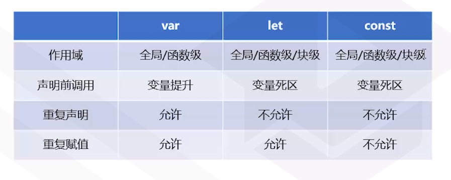

# ES6
* 全称 ECMAScript6（ECMA2015）,是JavaScript语言的下一代标准

## 1. ES6的模块化
### 1.1 在浏览器中使用ES6模块
* `<script type="module" src=''></script>`
* ES6的模块不属于函数作用域和全局作用域，属于模块`作用域`，即变量只在模块中有效
* 模块中自动使用严格模式
### 1.2 export & import
```javascript 
//a.js
//输出方式1
export var a = 1;
//输出方式2
var b = 2;
export {b}
//输出方式3
export default []
//输出方式3(输出改名)
var c = 3；
export {c as myC}

//b.js
import arr,{a,b,myC，d as myD} from './a.js';
//正常导入
import * as m from './a.js';
/**
* 异步导入
* 返回promise
* 函数参数是import返回的内容
*/
import('./a.js').then(function (m) {}）
```
	
## 2 定义变量的新方式
* 2.1 let关键字
	* 块级定义域
	* 不存在变量提升，未声明访问会有死区（报错）
	* 不允许重复声明
* 2.2 const关键字
	* 类似let上述三个属性
	* 定义常量
	* 不允许重复赋值
* 2.3 var、let、const对比
	
* 大部分情况下使用const，确实需要重复赋值，使用let
* var变量会提升，只提升声明不提升赋值

## 3 模板字符串
### 基本用法 换行处理 插值语句
```javascript
var name = "Trason";
var date = new Date().toLocalDateString();
//原生的换行处理需要用\n，模板字符串支持原生换行
var str = `Hello ${name}!
Today is ${date}.`;
// ${}里面可以写js语句，只要返回值是字符串类型
var str2 = `Today is ${new Date().toLocalDateString()}`;
```

## 4 函数扩展
### 4.1 箭头函数
* 省略`function`关键字
* 省略`参数括号`（只有一个参数的时候）
* 省略`return语句和{}`（函数体只有一句return语句的时候）
* return对象的时候，省略了{}，则需要给对象加()，表明return的是对象值而不是语句

### 4.1.1 箭头函数的this
* 是`声明时候所在环境`的this，为父级作用域的this，父级也为箭头函数则一直往上找
* 没有自己的this，则箭头函数`不能被当作构造函数`
* `没有arguments属性`
```javascript
//es6的this为window
//es5的this为test对象
const test = {
	a: 2,
	es5: function() {
		return this.a;
	},
	es6: () => this.a;
}
test.es5();//2
test.es6();//undefined
```

## 5 es6的默认参数
* 默认参数生效条件：`无传参或参数值为undefined的时候生效`，传false、null不生效
* `多参数`的时候，把默认参数放在`参数末尾`

```javascript
function(name="world") {
	console.log(`hello ${name}!`);
}
//多参数时，如果默认参数放前，则不传时需要传undefined
function(greeting,name='world') {
	console.log(`${greeting} ${name}!`);
}
```

## 6 es6的扩展参数
* 传入参数超出定义的参数个数时，多出来的成为`扩展参数数组`
* `取代arguments对象`
* 只能放在`参数末尾`
```javascript
const sum = (arg,...args) => {
	
}
sum(1,2,3,4,5);//arg=1,args=[2,3,4,5]
```
### 6.1 args与arguments
* args是数组，arguments是类数组

## 7 数组的扩展
* `...arr`: 将一个数组转化成值的序列
* 可以用在函数传参
* 可以用在数组定义
* `浅拷贝数组`

## 7.1 数组的解构赋值
* 基于位置的匹配
* 默认值、剩余值（类似函数参数）
* 嵌套结构
* const 模式 = 对应模式的对象/数组
```javascript
var samps = [[124,4],[undefined,53,2,8,9,45]];
const [[a,b],[c=1,d,...arr2]];
console.log(arr1);//[124,4]
console.log(c);//1
console.log(arr2);//[2,8,9,45]
```

## 7.2 数组新增静态方法（构造函数上的方法）
* `.from()` 将类数组对象/迭代器(map数据结构的keys()返回迭代器)转化成数组
* `.of()` 将一组值转换成数组，替代new Array()

### 7.2.1 new Array（）和Array.of()
* new Array()传一个数时会建立长度为输入数长度的数组

## 7.3 数组新增原型方法（实例方法）
* 基本用于取代for循环
* `.find(() => {})`
	* 找不到则返回undefined
* `.findIndex(() => {})`
* `.includes()`
	* 可以判断NaN,"同值相等算法"
	* .indexOf() 无法判断NaN
* `.fill()`
	* 适用于初始化数组，数组长度为100，每个值为0
* `.flat(num)`
	* 允许碾平的层数
* `.flatMap()`即.map().flat

## 8 对象的扩展
### 8.1 属性名的扩展
```javascript
//3种改进
//[key]计算属性值
var key = 1;
var name = 'Bob';
var obj = {
	name,
	method() {},
	[key]: name
}
//计算属性值调用
console.log(obj[key]);
```

### 8.2 对象的扩展运算符（ES9的新特性ES2018）
* 将目标对象的可遍历属性，拷贝到当前对象
* 同名属性的时候`后者覆盖前者`（`键值对`重复）
* `浅拷贝`

### 8.3 对象的解构赋值
* 基于位置的匹配（根据键名）
* 默认值、剩余值
	* 没有值或者undefined的时候默认值生效
* 重命名
* 嵌套解构

### 8.4 Object的新增静态方法
* `.assign()`用于合并多个对象
	* 更改`第一个对象`，可用空{}避免
* `.values()`,`.entries()`分别用于遍历值、键值对
	* .keys获取键值的 数组，键值是字符串
	* .values获取值的数组
	* .entries获取键值对[[key1,value1],[key2,value2]]
* `.fromEntries()`是`.entries()`的逆动作
* `.is()`实现了“同值相等算法”

### 8.4.1 `判断NaN & 区分 0 与 -0`
* 判断NaN
	* NaN === NaN; //false
	* Object.is(NaN,NaN); //true
	* Number.isNaN(NaN); //true
* 判断0与-0
	* 0 === -0; //true
	* Object.is(0,-0); // false
	* function isNegativeZero(n) {
		return 0 === n && 1/n === - Infinity;
	}

## 9 定义类的新方法
* class本质是function
* 强制使用严格模式
* 必须使用new关键字
* 不存在变量提升，会有死区

```javascript
class Animal {
	constructor(name,species) {
		this.name = name;
		this.species = species;
	}
	greet() {
		console.log(`Hello! I'm ${this.name},I belong to ${this.species}!`);
	}
	static staticFn() {
		console.log('This is a static function!');
	}
}
```
## 9.1 class的继承
* super方法，`只能继承原型上的方法`
* `静态方法自动继承`
```javascript
class Cat extends Animal {
	constructor(name) {
		super(name,'cat')
	}
	greet() {
		super.greet();
		console.log('Meow!');
	}
}
```

## 10 新的数据结构
### 10.1 Map
`var ages = new Map()`;
* 键可以是任何值的对象
* Map的增删查改
	* .has(tom)；
	* .delete(tom);
	* .get(tom);
	* .set(tom,10);//tom是对象
	* .size属性
	* .clear()；//所有键清空
	* .keys()；//获取键的迭代器
	* .entries();
	* .forEach(function(value,key,map){})
### 10.2 Set（集合）
* `键与值相同的Map`
* 成员的值唯一（同值相等算法）
	* `数组去重`
	```javascript
		var arr = [1,2,2,1,4,5];
		var set = new Set(arr);//[1,2,4,5]
		var newArr = Array.from(set);
	```
* 比Map少了set和get方法，多了add方法

### 10.3 weakSet & weakMap

## 11 新的基本数据类型——Symbol
* 互不相同的“字符串”，可作为属性名
* 可取代字符串常量
* 实现类的私有属性
```javascript
//生成方法
const s1 = Symbol();
const s2 = Symbol();
console.log(typeof s1);//Symbol
console.log(s1===s2);//false
//实现对象的私有属性
const obj = {
	[s1]: '1',
	[s2]: '2'
}
console.log(obj[s1]);//1
console.log(obj[s2]);//2

console.log(JSON.stringify(obj));//{}
console.log(Object.keys(obj));//[]
```
```javascript
const A = (function () {
	const key = Symbol();
	class A {
		constructor() {
			this[key] = 1;
		}
		getId() {
			return this[key];
		}
	}
	return A;
})
const a = new A();
console.log(a);//{Symbol():1}
a.getId();//1
const keys = Object.keys(a);//[]
console.log(JSON.stringigy(a));//{}
```

## 12 元编程
* 应用于`实现优雅的API`
* 基本用法object = {
	get a() {},
	set a(value) {}
}
* 只能拦截定义的属性
* 使用Proxy定义拦截器
	* get、set
	* has、deleteProperty(delete是关键字)
	* ownKeys、getOwnPropertyDescriptor
	* defineProperty
	* ...
```javascript
// var headers = {
// 	'content-type': 'text/plain'
// }
var headers = new Proxy({
	'content-type': 'text/plain'
},{
	get(target,key) {
		return target[key.toLowerCase()]
	},
	set(target,key,value) {
		target[key.toLowerCase()] = value;
	},
	has(target,key) {
		return key.toLowerCase() in target
	},
	deleteProperty(target,key) {
		delete target[key.toLowerCase()];
	}
})

console.log(headers['Content-Type']);
headers.X = 'x';
console.log(headers.x);//x
console.log('X' in headers);//true
```

## 13 回调函数
### 13.1 回调函数弊端
1. 如果回调嵌套很多层，代码结构不优雅
2. 如果回调嵌套很多层，变量需要避免冲突
3. 回调函数的错误处理两个方法，均繁琐
	* 加上错误捕捉回调函数
	* 回调函数里面增加错误err的参数,如果err是undefined则成功，否则有错误

## 14 Promise
* 盒子包裹了值，通过某些方法把值提取出去
* `new Promise()`
* `Promise.resolve()`
* `Promise.reject()`
* `Promise.then()`
### 14.1 Promise的三种状态：
* `pending`（异步过程未结束处于未定状态）
* `resolved`：异步过程未出错的状态
* `rejected`: 异步过程出错的状态
* Promise已经进入resolved或者rejected状态就不会改写

### 14.2 then
* `Promise`从`pending`到`resolved`状态时会调用then里传入的回调函数
### 14.2.1 详解then
```javascript
function log(...args) {
	console.log(...args);
}
function doSomething() {
	return Promise.resolve('something');
}

function doSomethingElse() {
	return Promise.resolve('something else');
}

doSomething().then(function(){
	//then中的function返回闭包	
	return doSomethingElse();
}).then(log);//'something else'

doSomething().then(function(){
	/**
	* 函数体中没有return语句，即同步函数
	* then中的function没有return语句，相当于返回undefined
	* then中传入同步函数，跟异步一样会用Promise.resolve包裹成promise再返回
	*/
	doSomethingElse();
}).then(log);//undefined

doSomething().then(doSomethingElse())
/**
* then中参数不是函数，则不跟在then调用链上，被忽略
* 传的是doSomethingElse执行结果
*/
.then(log);//'something'

doSomething().then(doSomethingElse).then(log);//'something else'
/**
 * 相当于以下函数
 * dosomething().then(() => {
 *	   return Promise.resolve('something else');
 * }).then(log)
 */
```


### 14.3 Promise替代回调函数
```javascript
const startTime = new Date().getTime() / 1000;
function log(...args) {
	var endTime =  new Date().getTime() / 1000;
	var time = (endTime - startTime).toFixed(1);
	console.log(`${time}s `,...args)
}
function add(x) {
	return new Promise((resolve,reject) => {
		setTimeout(() => {resolve(x + 5)},100)
	})
}
function times2(x) {
	return new Promise((resolve,reject) => {
		setTimeout(() => {resolve(x * 2)},200)
	})
}
function min(x) {
	return new Promise((resolve,reject) => {
		setTimeout(() => {resolve(x - 1)},300)
	})
}
function f(x) {
	return add(x).then(times2).then(min)
}
f(5).then(log);
```

### 14.4 Promise的错误处理
* .then(undefined,(err)=>{}) 相当于.catch((err)=>{})
* 上述两者区别：
	* .then(()=>{},(err)=>{})无法捕捉到成功回调函数报的错
	* .catch((err)=>{})放最后可以捕捉到成功回调函数报的错
	* .catch()放最后可以兜底前面所有then的链式调用栈中报的错
* 捕捉同步过程中的错误
```javascript
function add(x) {
	throw new Error('error');//同步过程中的错误
	return new Promise((resolve,reject) => {
		setTimeout(() => {resolve(x + 5)},100)
	})
}
function f(x) {//把add也放到异步过程中去捕获
	return Promise.resolve(x).then(add).then(times2).then(min)
}
f(10).then(log,log)
```

### 14.5 Promise实现并行过程
* Promise.all()执行三个函数，耗时为耗时最长的函数的时间，返回包含三个函数的返回值的数组,分别对应三个函数的位置
* Promise.race()`赛跑`，等待时长最短的函数，并返回该函数的返回值的闭包
* 参数为`数组`

