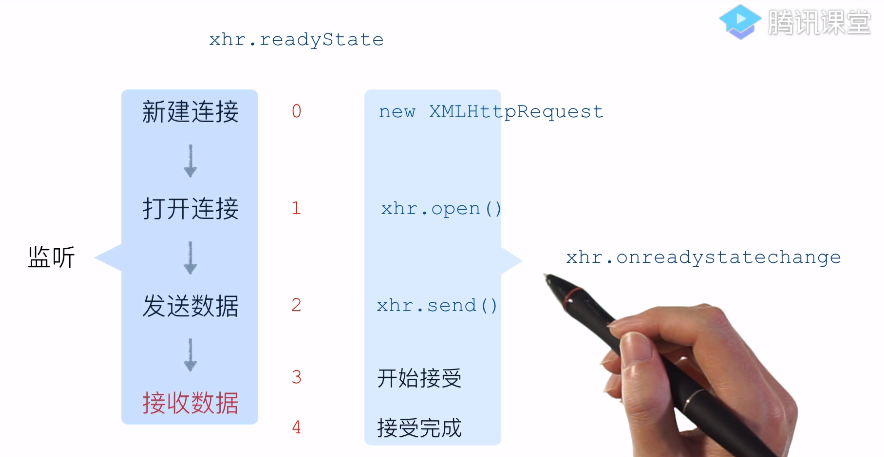

# ajax


## get 和 post
* get是把参数拼接到url上
    ```javascript
    xhr.open(type,urlMap[type] + (type === 'get' ? `?${data}`:'')
    ```
* post传参是传函数体formData，url上没有
    * 模拟post请求，必须设置个请求头
    * 原生的表单结构：`application/x-www-form-urlencode`
    ```javascript
    if(type==='post') {
        xhr.setRequestHeader('Content-Type','application/x-www-form-urlencode');
    }
    xhr.send(type==='get'?null:data)
    ```

## 同源策略（same-origin policy）
* 不同域（同域名、同协议、同端口号）的客户端脚本（JS）在没有明确授权的情况下不能读写对方的资源（ajax、cookie）

## 设置document.domain实现跨域
* 只能设置成当前域名或者基础域名
```javascript
//ke.qq.com设置document.domain实现跨域www.qq.com
document.domain = qq.com;
```

## CORS(Cross-Origin Resource Sharing)
* 基于HTTP实现
1. 浏览器ke.qq.com——>服务器www.qq.com
    * 发送请求头：Origin：https://ke.qq.com
2. 服务器www.qq.com——>浏览器ke.qq.com
    * 发送响应头：Access-Control-Allow-Origin：https://ke.qq.com

## JSONP
* JSONP中只能是GET方式传参，所以是在url上

## 借助iframe跨域
* <iframe src=""></iframe>
* 借用window.name跨域存储内容