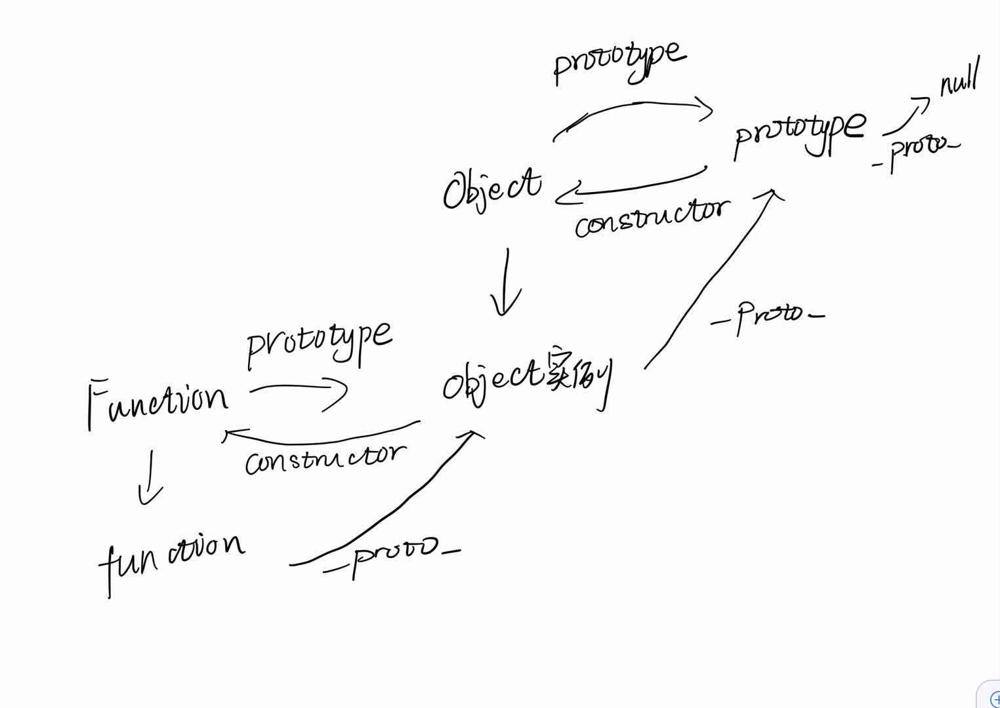

# 面向对象编程
## 1. 概念
* 对象：抽象的；实例：具体的
* 区别于面向过程编程
* 封装对象的方法，定义抽象对象，并实现继承
## 2. 模式
* 工厂模式
```javascript
function createBottle(name,price,isKeepWarm) {
    return {
        name: name,
        price: price,
        isKeepWarm: isKeepWarm
    }
}
var bottle = createBottle('太空杯'，49，true);
```
```javascript
function createPerson(name, age, sex) {
    var person = {
        name: name || '',
        age: age || '',
        sex: sex || ''
    };
    person.sayHello = function() {
        console.log(this.name);
    };
    return person;
}
var bottle = createBottle('太空杯'，49，true);
```
```javascript
function createPerson(name, age, sex) {
  return {
    name: name,
    age: age,
    sex: sex,
    sayHello: function() {
      console.log(this.name);
    }
  };
}
```
* 工厂模式的弊端
很难证明创建的对象是bottle对象，不同于其他基本类型的判断（解决方法在构造函数）

# 函数详解
* `name`:函数名
* `length`:形参的长度，`arguments`为实参，两个属性的长度不一定一样
* `prototype`:内含constructor属性
```javascript
//函数属性有name length prototype
function createElement() {
    //函数里有arguments和this
}
```
* 函数是first class
* 数据类型（没有语言局限的分类）
  + first class：可以作为函数的参数（回调函数）和返回值（闭包），也可以赋给变量
  + second class：可以作为函数的参数，但不能从函数返回，也不能赋给变量
  + third class：不能作为函数的参数

## 1. 闭包
闭包是指有权访问`另一个函数`作用域中的变量的`函数`(带有数据的函数)
```javascript
//eg1
function sendMsg(message) {
  setTimeout(function() {
    console.log(message);
  },1000);
}
sendMsg('hello');
```
jquery的原理
```javascript
(function() {
  var doc = document;
  var util = {
    byId: function(id) {
      return doc.getElementById(id);
    }
  }
  window.jQuery = util;
})();
jQuery.byId('hahah');
```

## 2. arguments
## 2.1 arguments储存函数的参数列表
```javascript
function createElement() {
    return {
        name：arguments[0],
        price: arguments[1],
        isKeepWarm: arguments[2]
    }
}

```
### 2.2 arguments特征及与形参对比
* `arguments`不是数组，是对象，类数组，具有length属性
* `arguments`与形参对比可读性差，尽量不要滥用
* `arguments`适合用于动态参数的场景
```javascript
//arguments动态参数场景
function supperAdd() {
   var len = arguments.length;
   var result;
   if (len) {
     result = 0;
     for(var i=0;i<len;i++) {
       result += arguments[i];
     }
   }
   return result;
}
supperAdd(1,2,3);//6
```
## 3. this
* this的指向不是在定义的时候确定的，是在其调用的时候所执行的环境中确定的
```javascript
//eg1
var price = 10;
var apple = {
  price: 8,
  getPrice: function() {
    return this.price;
  }
}
var getPrice = function() {
  return price;
} 
var result1 = getPrice();//10
var getPrice = apple.getPrice;
var result2 = getPrice();//10,执行环境为全局，所以this为全局
var result3 = apple.getPrice();//8
```
## 3.1 call(),apply(),bind()
* call()、apply()是立即执行函数，bind()不立即执行，只是返回绑定了上下文的函数
* call()和bind()接受多个参数，apply()接受参数数组

## 4. 私有变量
```javascript
/*
* 题目:
* 完善工厂函数 createPerson，需要完成以下要求：
* 1.保存传入参数 name 到一个私有变量中
* 2.函数返回一个对象，且对象带有一个方法 getName，用于返回对象的私有变量 name 的值
*/
function createPerson(name) {
  var privateName = name;
  return {
    getName: function() {
      return privateName;
    }
  }
}
```
## 5. 构造函数
* 构造函数首字母大写
* 没有显示的创建对象
* 将属性和方法赋值给this
* 没有return语句
* new操作符默认创建新对象，将this指向构造函数

  new 关键字会进行如下的操作：
  创建一个空的简单JavaScript对象（即{}）；
  链接该对象（即设置该对象的构造函数）到另一个对象 ；
  将步骤1新创建的对象作为this的上下文 ；
  如果该函数没有返回对象，则返回this。
 [参考](https://developer.mozilla.org/zh-CN/docs/Web/JavaScript/Reference/Operators/new)
* 实例 instanceof 抽象构造函数返回布尔值 
```javascript
function Bottle(name,price) {
  this.name = name||'';//注意没传参的兜底
  this.price = price||'';
  this.sayHello = function() {
    console.log('hello');
  }
}
var bottle = new Bottle('保温杯',199);
console.log(bottle instanceof Bottle);//true
```
## 5.1 构造函数缺陷
* 优点：构造函数解决了证明bottle是Bottle实例的问题
* 缺点: 功能相同的函数重复声明，重复声明消耗空间内存

## 6. 原型prototype
* `原型是函数的一个属性，是一个对象`
* 如果函数作为构造函数使用，通过同一个构造函数创建的实例`共享该构造函数的原型对象`
* `原型的理解`:
<br>
Object.prototype.constructor ===> Object构造函数<br>
 ||　　　　　\\\ <br>
 ||　　　　　　\\\ (实例的__proto__属性指向构造函数的prototype属性)<br>
 obj实例 ===> __proto__属性<br>

## 6.1 原型的属性
### 6.1.1 constructor
* 构造函数`Object.prototype.constructor===Object`
* 当函数声明后，一系列的操作会生成`prototype原型对象`，增加`constructor`属性指向`构造函数`
* 将 Person.prototype 设置为一个新创建的对象。会导致 Person.prototype 对象原来的 constructor 属性不再指向 Person, 这里可以像下面那样，特意的把constructor 设置为 Person。
```javascript
Person.prototype = {
  constructor: Person
}
```

### 6.1.2 读写
* 解决构造函数重复声明相同函数消耗内存和空间的问题，把重复函数放到原型对象里面
```javascript
function Bottle() {
  this.sayName = function() {
    console.log(this.name);
  }
}
//写
Bottle.prototype.sayHello = function() {
  console.log('Hello!');
}
var bottle1 = new Bottle();
var bottle2 = new Bottle();
//读
console.log(bottle1.sayHello === bottle2.sayHello);//true
console.log(bottle1.sayName === bottle2.sayName);//false
```

### 6.1.3 isPrototypeOf
```javascript
Bottle.prototype.isPrototypeOf(bottle1);
```

## 6.2 原型的弊端
* 实例共享原型属性导致数据污染（引用类型）
* 一个实例修改，则共享实例均被修改
```javascript
//属性没有修改的例子
var a = {key: 2};
var b = a;
a = {key: 1};
console.log(b);//b的值没有改变，因为a指向了另一个对象
```
## 7. 构造函数结合原型（参考6.1.2）
构造函数独享属性，原型共享方法
* 属性的`覆盖`：实例上的属性会`覆盖`原型上的属性，
* 属性的`查找`: 实例和构造函数找不到的属性，会往上找原型上的属性
* 属性的判断
  + in操作符：'name' in bottle1 只要实例（构造函数或者原型上）有这个属性就是true
  + hasOwnProperty：bottle1.hasOwnProperty('name') 属性在构造函数上为true，在原型上为false

## 8. 类
## 8.1 定义类
```javascript
class Person {
  constructor(name) {
    this.legs = 2;
    this.name = name;
  }
}
```
## 8.2 类的提升
`函数声明会提升，类声明不会提升，否则抛出ReferenceError`

## 8.3 类表达式
### 具名的类
```javascript
let Person = class Person2 {
  constructor(name) {
    this.name = name;
  }
}
```
### 匿名的类
```javascript
let Person = class {
  constructor(name) {
    this.name = name;
  }
}
```

## 9. 继承
继承可以使子类具有父类的属性和方法，而不需要重复编写相同的代码。
* 子类构造函数的原型指向父类的实例
* 子类实例的__proto__指向构造函数的原型，即父类函数的实例
## 9.1 原型链继承

* 属性查找顺序链：子类实例属性 ==> 子类构造函数 ==> 子类构造函数的原型prototype ==> 父类实例 ==> 父类构造函数 ==> 父类构造函数的原型prototype
* `function的，object`
## 9.1.1 原型链继承弊端
* 1.constructor指向问题
`解决办法`:子类的原型指向父类实例后，constructor属性指向了父类的构造函数，所以要子类的原型的构造函数手动指向子类构造函数
* 2.属性共享问题
父类实例具有共享属性且共享属性为引用类型的时候，子类实例修改共享属性会造成数据污染
`共享引用类型容易造成数据污染，基本类型影响不大`
* 3.子类不能传递父类参数
子类和父类都具有参数的时候不好区分

## 9.2 借用构造函数继承
* `优点`：可以传递参数，子类收到参数可以传递给父类构造函数原型
* `缺点`：不可以继承父类的原型上共享属性
```javascript
function Plane(color) {
  this.color = color;
}
function Fighter(color) {
  //继承Plane
  Plane.call(this,color);
  this.bullets = [];
}
var fighter = new Fighter();
```
## 9.3 组合继承
* 1. 属性和方法都是从父类继承的（代码复用）
  * 构造函数继承父类属性
  * 原型链继承父类原型共享属性和方法
* 2. 继承的属性是私有的（互不影响）
* 3. 继承的方法都在原型里（函数复用）
```javascript
function Plane(color) {
  this.color = color;
}
Plane.prototype.fly = function () {
  console.log('flying');
}
function Fighter(color) {
  Plane.call(this,color);
  this.bullets = [];
}
Fighter.prototype = new Plane();
//重定向构造函数指向Fighter而不因为原型指向Plane而构造函数指向Plane
Fighter.prototype.constructor = Fighter;
//先原型指向父类函数，再赋值特有函数
Fighter.prototype.shoot = function() {
  console.log('biubiubiu');
}
```
### 9.3.1 组合继承的不足
从上述代码可观察出
* `重复调用构造函数`Plane
* `属性冗余`Fighter原型中的color属性一直被覆盖不访问
 
## 9.4 继承的最佳实践
### 9.4.1 Object.create()与new Object()
  * `Object.create()`: 
    * `返回以输入参数为__proto__的实例对象，且修改属性是改原型上的。`
    * 1. 新建一个{}
      2. {}的__proto__指向Object.create的参数
      3. 返回{}
  * `new Object()`: 通过构造函数来创建对象, 添加的属性是在自身实例下。
### 9.4.2 解决重复调用构造函数的不足
```javascript
function Plane(color) {
  this.color = color;
}
Plane.prototype.fly = function() {
  console.log('flying');
}
function Fighter(color) {
  Plane.call(this,color);//复制属性
  this.bullets = [];
}
inheritPrototype(Fighter,Plane);
inheritPrototype2(Fighter,Plane);
//Fighter.prototype = new Plane()
//重复调用构造函数，目的是复制父函数原型上的方法
//优化
function inheritPrototype(subType,superType) {
  var protoType = Object.create(superType.protoType);
  protoType.constructor = subType;
  subType.prototype = protoType;
}
function inheritPrototype2(child,parent) {
  var Temp = function () {};//空函数目的是只继承原型上的方法足矣
  Temp.prototype = parent.prototype;
  child.prototype = new Temp();
  child.prototype.constructor = child;

}
```
## 9.5 es6继承
```javascript
class Person {
  constructor (name) {
    this.name = name;
  }
  sayName() {
    console.log(this.name);
  }
}
class Student extend Person{
  constructor (name,grade) {
    super(name);//相当于Person.call(this,name)
    this.grade = grade;
  }
  sayGrade() {
    console.log(this.grade);
  }
}
```


# 数组
[数组方法汇总](https://www.cnblogs.com/xianxiaoan/p/11019627.html)
## 1. 类数组
* 类数组转换成数组
```javascript
//类数组
var arrLike = {
  0: 'a',
  1: 'b',
  2: 'c',
  length: 3
}
//类数组转换成数组
//slice没有传参返回含所有下标的元素的新数组
var arr = [].slice.call(arrLike);
console.log(arr);//[a,b,c]
```
* 实例继承原生方法
```javascript
//空数组是Array构造函数的实例，继承了Array.prototype的slice()方法
[].slice === Array.prototype.slice();//true
```
* call()调用函数并改变函数内部的this指向


## 2. 数组
### 2.1 slice() 和 splice() 和 concat()
* `splice(param1,param2,param3)`可以增删改原数组
  - param1：起始位置，增加到此位置，从此位置替换，从此位置开始删除
  - param2：0为插入，>0则删除或者替换
  - param3：数组的替换内容，`参数属性为什么则替换成什么`
*  `slice(param1,param2)`返回数组中的下标区域[start,end)
  - param1: start起始下标
  - param2：end结束下标
  - param2为空则到数组结尾
  - param1 < param2 
  - param1和param2可以为负数，负数则为从尾部开始数第n个
*  `concat(param)`合并数组
  - param：可以是数组或者数字，`数组则合并数组内的参数`
* concat()、slice()不改变原数组,splice()改变原数组

## 形参和函数内变量的问题
* 形参是函数内变量，重复声明值一样，重新赋值则会覆盖