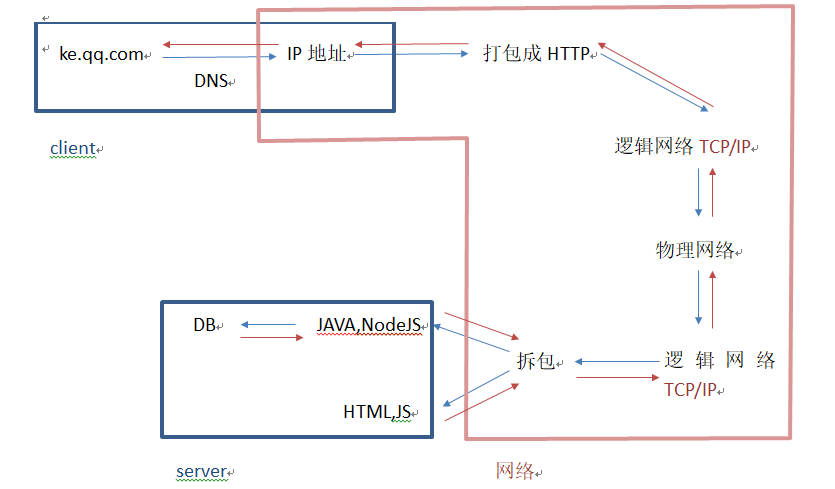
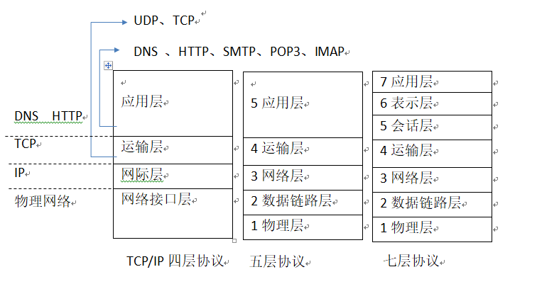
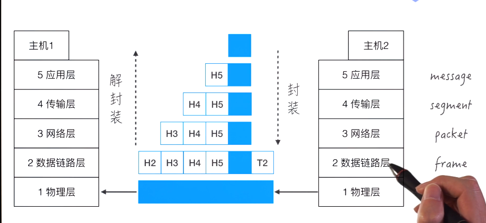
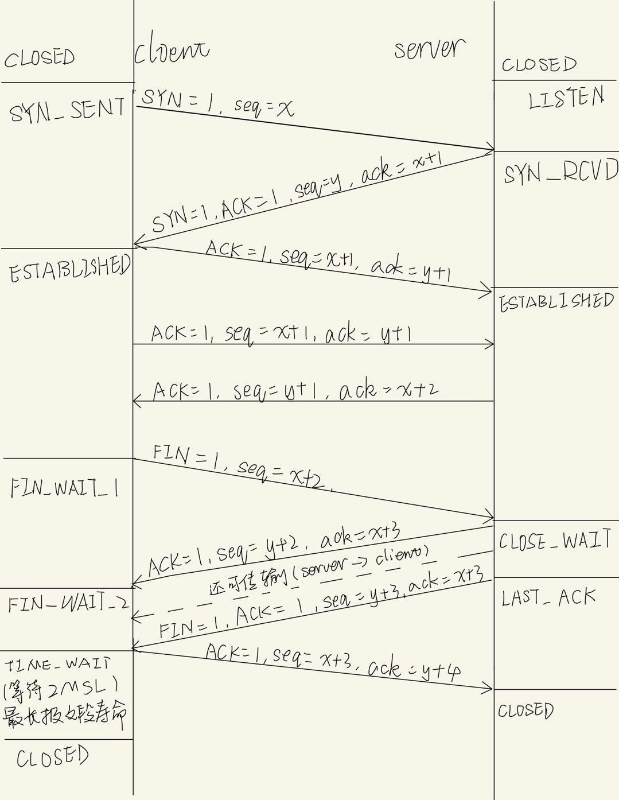
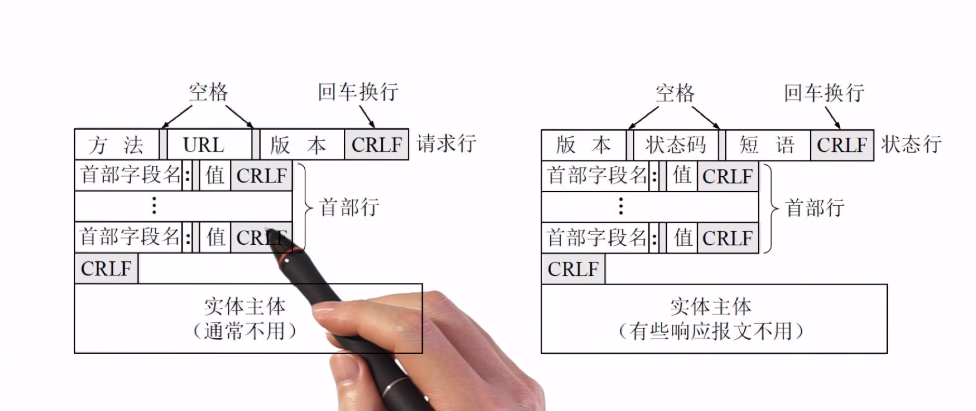

# 1. 从输入地址到返回请求

# 2. 网络体系结构

# 3. 分组
* 文件分成组来传输，不按顺序传输，但有头部，接受的服务器根据组别的头部排序重新组合成文件

# 4. TCP（Transmission Control Protocol)传输控制协议
* 一种面向连接的、可靠的、基于字节流的传输层通信协议
## 4.1 三次握手四次挥手

* `必须三次握手的原因`： 避免客户端之前发送的连接请求因网络堵塞导致延迟到达服务端，客户端已重新发送并建立链接后又关闭，如果两次握手即可，则延迟的链接请求重新形成链接，损耗服务器的资源。

# 5. HTTP(HyperText Transfer Protocol)超文本传输协议
* 一种用于分布式、协作式和超媒体信息系统的应用层协议
* 特点
    1. `无连接`：一次只处理一个http请求
    2. `无状态`：不能记住上次请求的信息，需重传,不能识别登陆态
## 5.1 HTTP的报文结构(request & response)

## 5.2 HTTP状态码
* 1xx 通知信息，如请求收到或正在处理
* 2xx 表示成功
* 3xx 表示重定向
    * 301永久重定向
    * 302临时重定向
    * 304资源没有修改过，你还可以用本地缓存
* 4xx 表示客户端差错
* 5xx 表示服务器差错

# 6. 浏览器的缓存
* from disk cache 缓存到用户硬盘
    * 非脚本缓存到用户硬盘：css
* from memory cache 缓存到内存
    * 脚本、字体图片缓存到内存
    * 脚本执行频繁，缓存到内存中减少IO流，不用从硬盘中先读取到缓存

## 6.1 浏览器缓存相关请求头
* response header
    * `cache-control`: max-age=30（秒）相对时间，优先级高于`expires`
    * `expires`: 绝对时间，格林尼治时间
    * `last-modified`: 文件最后修改的时间
* request header
    * `if-modified-since`: 最后修改时间

## 6.2 l浏览器缓存的逻辑流程
1. 浏览器向服务器第一次请求，返回`cache-control`,`expires`,`last-modified`
2. `强缓存`：在`cache-control`时间范围内第二次请求，会直接从本地读取缓存
3. `协商缓存`
    * 机制一： 最后修改时间
        * 超过`cache-control`时间范围，会向服务器发送`if-Modified-Since`
        * 文件没改：返回304，从本地获取缓存
        * 文件改了：返回200，更新`last-modified`
    * 机制二： 内容是否修改（解决重复内容填写，但最近修改时间改动问题）
        * 使用`Etag`（内容处理成的hash值）标记
        * 向服务器发送`if-None-Match`

# 7. DNS(Domain Name System)域名系统
## 7.1 域名分级
    * 根（虚拟域名）——根域名服务器
    * 顶级域名——顶级域名服务器
    * 二级域名\
    * 三级域名— 权限域名服务器
    * 四级域名/
## 7.2 域名查询方式
    1. 迭代查询
    2. 递归查询